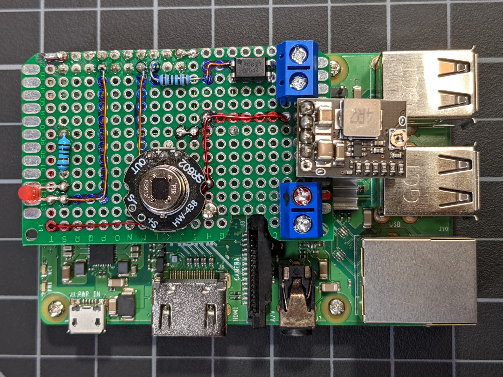

# Air Gapped Object Detection Sensor
Camera based object detection is extremely useful, but unfortunately poses considerable challenges with regard to privacy. This project aims to create a sensor that can detect the presence of people (or other objects) but operates like a traditional PIR motion sensor by triggering an alarm dry contact thus negating the need for network connectivity and increasing privacy. This allows for the installation of the sensor in areas that require a high privacy.

# Why?
You may be asking youself why the need for an air gapped object detection sensor? Well I started my home automation journey because I wanted to save electricity, turning things off in rooms that weren't in use. The challenge with this is there aren't really any fool proof ways to detect the presence of a person in a given area. I started with traditional PIR based motion sensors but they just weren't any good at detecting prolonged occupancy. For example, while watching a movie you may not generate enough motion to trigger the PIR and your TV shuts off in the middle of the movie. I tried Microwave/Dopplar sensors like the RCWL-0516, but they also required movement and were extremely challenging to confine to a given space (they can detect through walls). I tried infrared arrays like the Omron D6T and the AMG8833 and really though they were the answer, but realized that they were too easily tripped up by heat masking objects (aka a blanket). I tried measuring CO² & Humidity levels, the 'WASP in a box' technique, Bluetooth trackers, and all of them had their issues. I tried creating a multi-sensors that combines several of these techniques and applied a Bayesian filte to them, but they still weren't reliable. I stumbled across DOODs and Frigate and thought my occupancy detection challenges were over, and they are for the most part except for one area, bedrooms! How do you maintain privacy when object detection like TensorFlow Lite is based on image capturing? The answer, localize the object detection and air gap the device. I already have a smart alarm system that monitors doors, windows, and motion sensors and its tied into Home Assistant. So a dry contact alarm switch was a logical fit. I know, TensorFlow is far from perfect at detecting a person, and it can be thwarted by a blanket, but in conjunction with a traditional PIR motion sensor it has yielded very acceptable results. I also group the AGODS with a Bed Occupancy sensor (load cells) for higher accuracy in the bedrooms.

# Privacy:
* Raspberry Pi is not network connected
  - If your IoT network is hacked, they can't get to these sensors
  - No way of streaming camera footage or capturing images remotely
* Images are not stored to disk except when in --debug mode
* Overlay File System prolongs SD Card lifespan, but also means that anything written to disk is destroyed upon reboot/power cycle.
  - For example, if someone were to steel it off the wall, the power would be cut and --debug images would not survive.
* Alarm contact can be used like any traditional home security motion sensor. PIR and Person detection trigger the alarm contact.

# Features:
* AGODS HAT
  - PIR Motion Sensor
  - Activity LED
  - Alarm dry contact
  * Wiring & Power
    - Wired like a traditional home security motion sensor with 4 conductor wire.
    - Runs on 12v (or as little as 5v by adjusting the buck converter).
    - Drop in replacement for an existing home security motion sensor.
* Debug Mode
  - Images are written to disk (but will not survive a reboot if OverlayFS is enabled and Boot Partition is set to Read Only)
  - Motion Detection and Object Detections are logged to console
* Composite Output
  - Using the proper AV cable, you can connect the Raspberry Pi 3.5mm AV jack to a TV to aid in aligning the sensor's object detection area

# Requirements
* Patience, and your beverage of choice
* Basic electronics skills
* A way of monitoring a dry contact switch
  - Ecolink Z-Wave Plus Door/Window sensor with external input (https://www.amazon.com/Z-Wave-Magnets-Window-Sensor-DWZWAVE2-5-ECO/dp/B01N5HB4U5)
  - Ring Retrofit Alarm Kit (https://www.amazon.com/Introducing-Ring-Retrofit-Alarm-Kit/dp/B07Y926SS8)
  - Konnected.io (https://www.amazon.com/Konnected-Alarm-12-Zone-System-Retrofit/dp/B08RJZPPYR)
* A Raspberry Pi. I recommend the Raspberry Pi 2B for ultimate privacy since it doens't have wireless built in, but they are probably hard to find at this point. Alternative would be a Raspberry Pi 3B+ with Wifi disabled.
* A Raspberry Pi Camera
* Various electrical components
  - 3.3v LED
  - 10k Resistor (you can use different levels of resistance to get the level of LED brightness you desire)
  - 100k Resistor (for Optocoupler)
  - PC817 Optocoupler
  - SR602 PIR sensor
  - Drok 12v to 5v buck converter (https://www.amazon.com/gp/product/B08Q3PMJTT)
  - 10x2 female pin header
  - 4x1 female pin header
  - 4x1 male pin header
  - 2 pin Terminal (qty 2)
  - Soldering Iron, Solder, and Flux
  - Wire (I recommend Enamled Wire aka Magnet Wire, but any small gauge wire will do)
  - Plastic Stand-Off (can be 3D Printed)

# Optional
* Motion Detector Enclosure / Donor Device (https://www.amazon.com/Kenuco-Analog-Covert-Motion-Detector/dp/B072BXK1QP)
  - Other enclosures may be suitable but the 3D Printed parts likely won't work.
* Basic case modding skills (you're gonna want a Dremmel!)
* 3D Printer
* Hot Glue Gun


# Recommendations
* Disable WiFi.
* If network access is needed
  - Set a static IP on the ethernet interface outside of your normal network range, and don't assign a gateway.
  - Patch directly from the AGODS to your computer and access it via SSH (SSH is not enabled by default).

Changes:
- Initial Release: 0.0.1
<br/>

## :heavy_check_mark: ToDo:
- [ ] Configurable detection area.
- [ ] Debug images contain TF Labels & detection boxes
<br/>

## :bookmark_tabs: Table of Contents
- [Screenshots](#camera-screenshots)
- [Getting Started](#getting-started)
- [References](#references)
<br/>

## :camera: Screenshots and Pictuers
### PCB / Bread Boarding
<br/>
Note: The pin out on the PIR is different than the SR602, I couldn't find a part for it in Fritzing. Adjust accordingly if using a SR602.<br/><br/>
<br/>
This diagram has the correct pin out for the SR602 (no adjustments necessary, unless you use a different PIR sensor). Note this PCB diagram is untested and measurements are approximate.
### Use at your own risk!

<br/>

## AGODS HAT





## Enclosure


### Case Mods


[:top:](#bookmark_tabs-table-of-contents)
<br/>
<br/>

## Getting started
* Install Raspbian Lite
* Clone AGODS or download and extract to /home/pi/
* Run ```/home/pi/AGODS/setup.sh```
* Modify ```/boot/agods.ini``` (if necessary)
* Run ```sudo raspi-config``` and enable Overlay file system (optional but recommended)

[:top:](#bookmark_tabs-table-of-contents)
<br/>

## References
TensorFlow Lite. See https://github.com/CapnBry/HeaterMeter/wiki/Accessing-Raw-Data-Remotely
Parts. https://community.home-assistant.io/t/heatermeter-integration/14696/22  
[:top:](#bookmark_tabs-table-of-contents)
